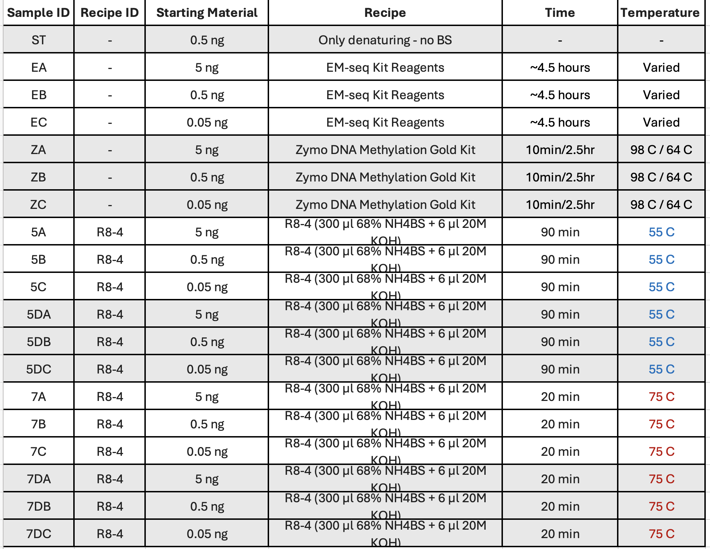

## Project: Low Temperature UMBS Optimization 
#### Investigator: Yushuai Liu
#### Analysis: C. Bryan Daniels
#### Sequencing: Chang Ye
#### Supervisor: Qing Dai
#### Date: September 2, 2024

## Background
To evaluate the performance of UMBS at lower temperatures 

## Protocol

[Full Protocol](docs/protocol.pdf)

## Notebook

[See Jupyter Notebook](workspace/ubs_seq.ipynb) 

## Genomic References<aside>

<aside>

- ***164 mer oligo (77+, 127+, 93-, 128-)*** [5mC164.fa](https://raw.githubusercontent.com/prairie-guy/Genomic_References/main/BAT_seq/5mC164.fa)

- **200 mer oligo (CG 123+; 124- )**
        [200merMeth.fa](https://raw.githubusercontent.com/prairie-guy/Genomic_References/main/BAT_seq/200merMeth.fa);
        [200mer_oligo_for_methylation.dna](https://prod-files-secure.s3.us-west-2.amazonaws.com/04c7f2aa-4abc-46e2-98f7-687750d34a4b/58ca08e3-6919-4711-ad4d-d2692f752922/200mer_oligo_for_methylation.dna)

- **pUC19 plasmid (All CpG motifs are 100% methy)**
        [pUC19.fa](https://raw.githubusercontent.com/prairie-guy/Genomic_References/main/BAT_seq/pUC19.fa)

- **lambda DNA (All sites are unmethylated)**
        [lambda.fa](https://raw.githubusercontent.com/prairie-guy/Genomic_References/main/BAT_seq/lambda.fa)

- **Homo sapiens.GRCh38.rRNA.fa.gz**
        [rRNA](https://github.com/prairie-guy/Genomic_References/raw/refs/heads/main/RNA/Homo_sapiens.GRCh38.rRNA.fa.gz)

- **Homo sapiens.GRCh38.111.primary_assembly.fa.gz**
        [DNA](https://github.com/prairie-guy/Genomic_References/raw/refs/heads/main/DNA/Homo_sapiens.GRCh38.111.primary_assembly.fa.gz)

- **Homo sapiens.GRCh38.111.chr.gtf.gz**
        [GTF](https://github.com/prairie-guy/Genomic_References/raw/refs/heads/main/DNA/Homo_sapiens.GRCh38.111.chr.gtf.gz)

- **Arabidopsis thaliana**
        [DNA](https://github.com/prairie-guy/Genomic_References/raw/refs/heads/main/DNA/Arabidopsis_thaliana.TAIR10.dna.toplevel.fa.gz)

        - Note: Chr names across all fasta and GTF files must be unique. For Arabidopsis, fasta headers edited:  >1 -> >ar1, ....

<aside>

## Experiment

 
## Results

[Figures](workspace/figures)

