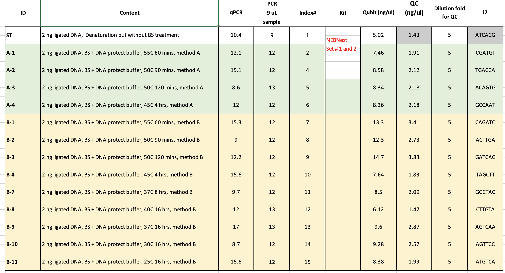

## Project: Testing cfDNA with 164mer Model
#### Investigator: Tanner Baldwin
#### Analysis: C. Bryan Daniels
#### Sequencing: Chang Ye
#### Supervisor: Qing Dai
#### Date: August 8, 2024

## Background
Previously, we optimized the R8 recipe to achieve very satisfactory conversion efficiency while causing minimal DNA damage to lambda DNA with pUC19 and 164mer spike-ins. We sent the reagents for this optimized recipe to Dr. Yuval, our Israeli collaborator and they tested the method on cfDNA. Surprisingly, the results showed that our method performed less well than the Zymo DNA Methylation Gold kit when assessed with digital droplet PCR (ddPCR). We do not have a ddPCR machine in Chicago, but we will test our method more rigorously with cfDNA provided by Yushuai as well as a methylated ds164mer spike-in as a control. We will also test our method starting from 5, 0.5, and 0.05 ng cfDNA with dsDNA 164mer as spike in and compare with EM-seq and Zymo gold kit with the same DNA input.

The final round of R8 optimization showed that R8-4 is the optimal recipe in both 55 C for 90 min and 75 C for 20 min. We also found that the reaction with 10% DME achieves best conversion efficiency (although perhaps at the cost of some additional damage). Since R8-4 at 55 C for 90 min showed better performance in terms of both the DNA damage and BS efficiency. We will try this condition. In addition, since our sequencing data in last round showed that adding 10% DME can further improve the BS efficiency, we will also test R8-4 (40 ¯ul) + 5 ul denatured DNA + 5 ul DME to make comparison. Tanner did the dsDNA ligation for both cfDNA and 164 bp DNA. The QC of the ligated DNA showed the expected pattern, suggesting that the mistake caused by adding ligation did cause serious self-ligation of cfDNA. However, the OCC purification to try to recovery the cfDNA did cause significant cfDNA loss. Based on the QC results, the concentration of the ligated cfDNA is 4 ng/µl and based on calculation the original cfDNA retained is ~3 ng/µl. We decided to do four group of libraries, with each group containing 3 samples starting from 5, 0.5, and 0.05 ng cfDNA.

## Protocol

[Full Protocol](docs/protocol.pdf)

## Notebook

[See Jupyter Notebook](workspace/ubs_seq.ipynb) 

## Genomic References<aside>

<aside>

- ***164 mer oligo (77+, 127+, 93-, 128-)*** [5mC164.fa](https://raw.githubusercontent.com/prairie-guy/Genomic_References/main/BAT_seq/5mC164.fa)

- **200 mer oligo (CG 123+; 124- )**
        [200merMeth.fa](https://raw.githubusercontent.com/prairie-guy/Genomic_References/main/BAT_seq/200merMeth.fa);
        [200mer_oligo_for_methylation.dna](https://prod-files-secure.s3.us-west-2.amazonaws.com/04c7f2aa-4abc-46e2-98f7-687750d34a4b/58ca08e3-6919-4711-ad4d-d2692f752922/200mer_oligo_for_methylation.dna)

- **pUC19 plasmid (All CpG motifs are 100% methy)**
        [pUC19.fa](https://raw.githubusercontent.com/prairie-guy/Genomic_References/main/BAT_seq/pUC19.fa)

- **lambda DNA (All sites are unmethylated)**
        [lambda.fa](https://raw.githubusercontent.com/prairie-guy/Genomic_References/main/BAT_seq/lambda.fa)

- **Homo sapiens.GRCh38.rRNA.fa.gz**
        [rRNA](https://github.com/prairie-guy/Genomic_References/raw/refs/heads/main/RNA/Homo_sapiens.GRCh38.rRNA.fa.gz)

- **Homo sapiens.GRCh38.111.primary_assembly.fa.gz**
        [DNA](https://github.com/prairie-guy/Genomic_References/raw/refs/heads/main/DNA/Homo_sapiens.GRCh38.111.primary_assembly.fa.gz)

- **Homo sapiens.GRCh38.111.chr.gtf.gz**
        [GTF](https://github.com/prairie-guy/Genomic_References/raw/refs/heads/main/DNA/Homo_sapiens.GRCh38.111.chr.gtf.gz)

- **Arabidopsis thaliana**
        [DNA](https://github.com/prairie-guy/Genomic_References/raw/refs/heads/main/DNA/Arabidopsis_thaliana.TAIR10.dna.toplevel.fa.gz)

        - Note: Chr names across all fasta and GTF files must be unique. For Arabidopsis, fasta headers edited:  >1 -> >ar1, ....

<aside>

## Experiment

 
## Results

[Figures](workspace/figures)

